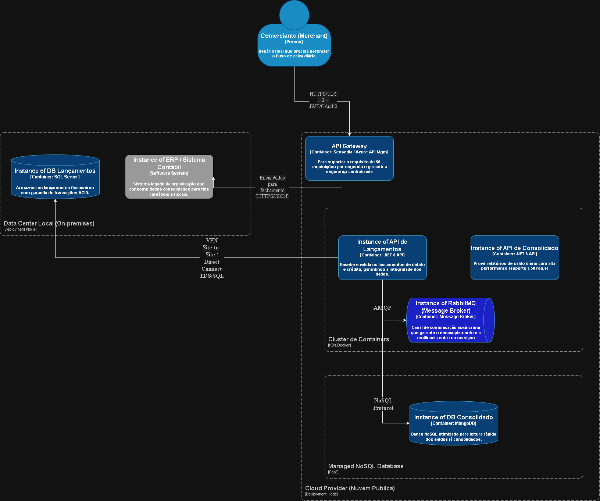

# Comunicação Arquitetural — Resilient Ledger

## 1. Abordagem de Modelagem
A solução utiliza o **C4 Model** para garantir clareza na distribuição de responsabilidades e permitir diferentes níveis de "zoom" técnico para stakeholders executivos e times de engenharia.

---

## 2. Visão Lógica (C4 Context & Containers)

### Nível 1: Diagrama de Contexto
Apresenta o sistema Resilient Ledger como o motor central, interagindo com o Comerciante e o ERP Legado da organização.

### Nível 2: Diagrama de Containers
Detalha a API de Lançamentos (.NET 8), API de Consolidado (.NET 8), o broker de mensageria RabbitMQ e a persistência poliglota (SQL Server e MongoDB). A arquitetura é orientada a eventos (EDA) para garantir o desacoplamento exigido pelo edital.

  

---

## 3. Visão Física (Topologia de Deploy)
Para atender ao ponto 9 do edital sobre aproveitamento de legado, adotamos um **Modelo de Infraestrutura Híbrida**. Este diagrama separa claramente a visão lógica (containers) da visão física (nós de deploy).

### Detalhamento dos Nós de Implantação:
* **Data Center Local (On-premises):** Hospeda o SQL Server (Core Transacional) e o ERP Legado, protegendo o investimento em hardware existente e garantindo a soberania dos dados.
* **Cloud Provider:** Hospeda o API Gateway, os clusters de containers elásticos e o MongoDB (PaaS), suportando picos de **50 requisições por segundo**.

---

## 4. Estratégia de Transição (Strangler Fig Pattern)
Utilizamos o padrão de modernização via estrangulamento para mitigar riscos operacionais. O novo sistema assume as operações de fluxo de caixa enquanto se integra gradualmente ao legado, enviando dados consolidados via HTTPS/JSON para fechamento contábil no ambiente local.

## 5. Protocolos e Interações
* **Comunicação Externa:** HTTPS / TLS 1.2+ com autenticação OAuth2/JWT.
* **Integração Híbrida:** VPN Site-to-Site com protocolo TDS/SQL para o banco local.
* **Mensageria Assíncrona:** Protocolo AMQP para comunicação entre microsserviços via RabbitMQ.
