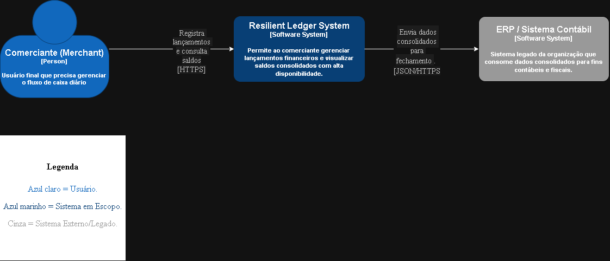
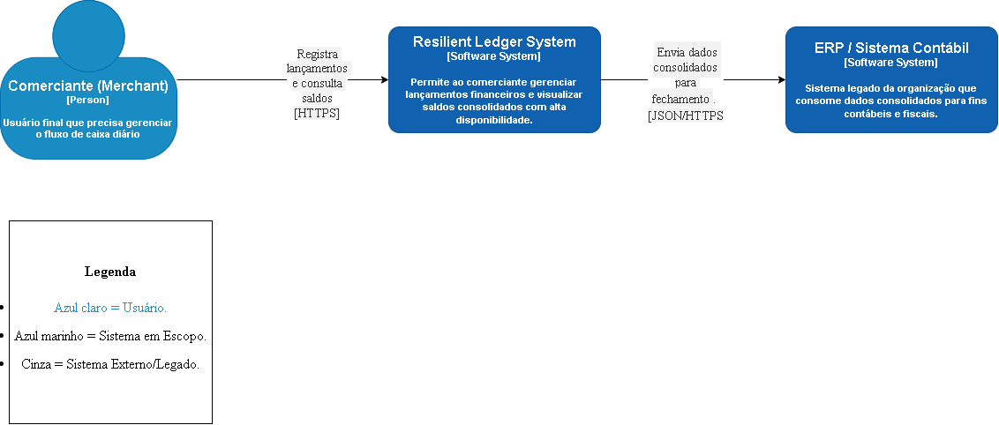

# Architecture - C4 Model

## Level 1: Context Diagram
Este diagrama apresenta a visão de sistema do **Resilient Ledger System**, detalhando suas fronteiras, os principais atores (Comerciante) e as integrações externas estratégicas (ERP/Legado). O foco aqui é a comunicação de valor e as interações de alto nível sob o protocolo HTTPS.

---
*Nota: Este diagrama segue os padrões do C4 Model para garantir a clareza na comunicação técnica e de negócio exigida pelo desafio.*

## Level 2: Container Diagram
Neste nível, "abrimos a caixa" do sistema para detalhar sua estratégia de resiliência. Utilizamos um **API Gateway** para segurança centralizada, **RabbitMQ** para garantir o desacoplamento entre escrita e leitura, e **Persistência Poliglota** (SQL para transações e NoSQL para consultas rápidas).

.
